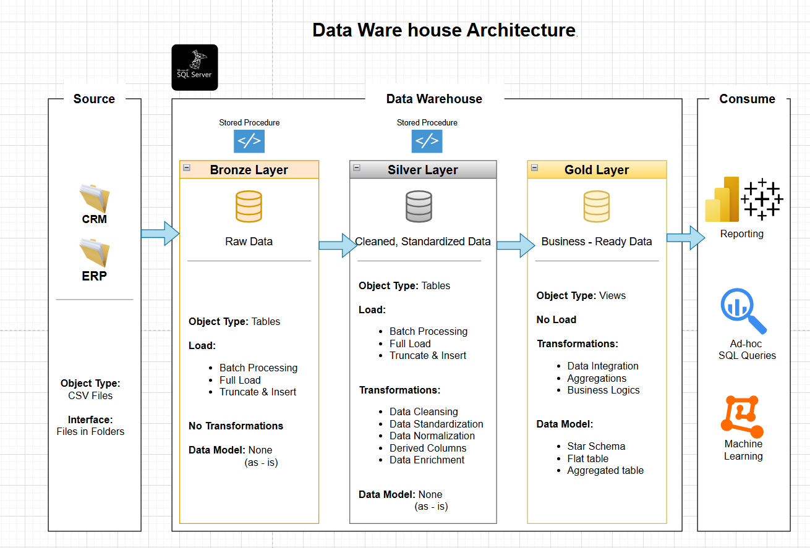

# 📊 Data Warehouse & Analytics Project

🚀  Welcome to my **Data Warehouse and Analytics Project**! 
This project showcases a complete data warehousing and analytics solution — from raw data ingestion to building insightful business reports. It is built using **SQL Server** and follows industry best practices in **ETL, data modeling**, and **data analysis**.

---

## 🏗️ Data Architecture – Medallion Layers

The project implements the **Medallion Architecture**, separating the data into three layers for better management and scalability:




- **🔹 Bronze Layer**  
  Raw data ingestion from CSV files (ERP and CRM) into SQL Server without transformation.

- **🔸 Silver Layer**  
  Cleansed and standardized data prepared for modeling.

- **⭐ Gold Layer**  
  Business-ready data modeled into a **star schema** for reporting and analytics.

---

## 📖 Project Overview

This project includes:

- 🏛️ **Data Architecture**  
  Designing a modern data warehouse using the **Medallion Architecture** with Bronze, Silver, and Gold layers to organize and transform data effectively.
  
- 🔄 **ETL Pipelines**  
  Building SQL-based ETL pipelines for extracting, transforming, and loading data.

- 🏗️ **Data Modeling**  
  Designing fact and dimension tables based on star schema principles for optimized analytical queries.

- 📊 **Analytics & Reporting**  
  Writing SQL queries to generate insights into customer behavior, product performance, and sales trends.

---

## 🎯 Skills Demonstrated

- SQL Development  
- ETL Pipeline Creation  
- Data Cleansing and Transformation  
- Dimensional Data Modeling (Star Schema)  
- Data Warehousing Concepts  
- Business Intelligence and Analytics

---

## 🛠️ Tools & Technologies

- **SQL Server Express** – Hosting the data warehouse  
- **SQL Server Management Studio (SSMS)** – Query writing and management  
- **CSV Files** – Source data from ERP and CRM systems  
- **Draw.io** – Designing ETL workflows, data models, and architecture diagrams  
- **Notion / Markdown** – For project planning and documentation

---

## 🚀 Project Requirements

### Building the Data Warehouse (Data Engineering)

**Objective**  
Develop a modern data warehouse using SQL Server to consolidate sales data, enabling analytical reporting and informed decision-making.

**Specifications**

- **Data Sources**: Import data from two source systems (ERP and CRM) provided as CSV files.  
- **Data Quality**: Cleanse and resolve data quality issues prior to analysis.  
- **Integration**: Combine both sources into a single, user-friendly data model designed for analytical queries.  
- **Scope**: Focus on the latest dataset only; historization of data is not required.  
- **Documentation**: Provide clear documentation of the data model to support both business stakeholders and analytics teams.  

---

### BI: Analytics & Reporting (Data Analysis)

**Objective**  
Develop SQL-based analytics to deliver detailed insights into:

- Customer Behavior  
- Product Performance  
- Sales Trends  

These insights empower stakeholders with key business metrics, enabling strategic decision-making.

---
## 📁 Repository Structure

```
data-warehouse-project/
│
├── datasets/                           # Raw datasets used for the project (ERP and CRM data)
│
├── docs/                               # Project documentation and architecture details
│   ├── etl.drawio                      # Draw.io file shows all different techniques and methods of ETL
│   ├── data_architecture.drawio        # Draw.io file shows the project's architecture
│   ├── data_catalog.md                 # Catalog of datasets, including field descriptions and metadata
│   ├── data_flow.drawio                # Draw.io file for the data flow diagram
│   ├── data_models.drawio              # Draw.io file for data models (star schema)
│   ├── naming-conventions.md           # Consistent naming guidelines for tables, columns, and files
│
├── scripts/                            # SQL scripts for ETL and transformations
│   ├── bronze/                         # Scripts for extracting and loading raw data
│   ├── silver/                         # Scripts for cleaning and transforming data
│   ├── gold/                           # Scripts for creating analytical models
│
├── tests/                              # Test scripts and quality files
│
├── README.md                           # Project overview and instructions
├── LICENSE                             # License information for the repository
```
</details>
